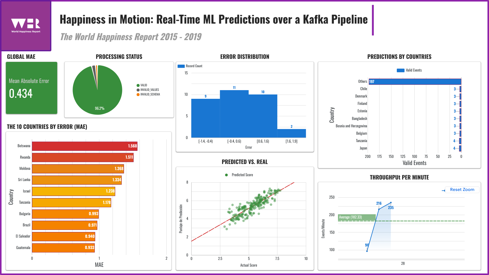

# Workshop-3: Streaming ETL with Kafka, MySQL and ML

End-to-end Streaming ETL pipeline that takes 5 CSVs from the World Happiness Report (2015–2019) with heterogeneous schemas, harmonizes them, performs EDA, and trains a Linear Regression model. The project then simulates a streaming environment using an Apache Kafka producer that sends test-split records as JSON events, and a consumer that processes them in real-time. Results are stored in a MySQL star schema and exposed through a Looker Studio (now Google Data Studio) dashboard.

---

## 1. Architecture overview

### Offline (Batch + Training)
```text
data/raw/*.csv
    │
    ▼
┌────────────────┐    ┌──────────────────┐    ┌─────────────┐
│   EDA          │───▶│ model_training   │───▶│ model.pkl   │
│  .ipynb        │    │     .ipynb       │    │ train.csv   │
│ (profiling     │    │ unified.csv      │    │ test.csv    │
│  & cleaning)   │    └──────────────────┘    └─────────────┘
└────────────────┘    
```

### Streaming
```text
test.csv ──▶ Producer ──▶ Kafka Topic ──▶ Consumer ──▶ MySQL ──▶ Looker Studio (now Google Data Studio)
              │             happiness-       │          ┌──────────────┐
              │             predictions      │          │ raw_events   │
              │                              │          │ dim_country  │
              └── noise injection (5%)       │          │ dim_date     │
                                             │          │ dim_raw_event│
                                             │          │ fact_preds   │
                                             │          └──────────────┘
                                             └── model.pkl (predict)
```

---

## 2. Repository layout

```text
etl-workshop_3/
├── data/
│   ├── raw/                      # Original CSVs (2015.csv - 2019.csv)
│   ├── processed/                # Harmonized datasets and train/test splits
│   └── streaming/                # Kept for PDF structure compliance (unused, Consumer writes direct to DB)
├── notebooks/
│   ├── eda.ipynb                 # Step A.0 & A.1: Data Profiling, Cleaning, and EDA
│   └── model_training.ipynb      # Steps A.2-A.4: Harmonization, Feature Engineering, Model Training
├── kafka/
│   ├── producer.py               # Step B.3: Simulates real-time event streaming
│   └── consumer.py               # Step B.4: Real-time inference and MySQL persistence
├── models/
│   └── model.pkl                 # Serialized Linear Regression pipeline
├── sql/
│   ├── create_tables.sql         # DDL for MySQL star schema tables
│   └── kpis.sql                  # 8 SQL queries used for the dashboard
├── dashboards/
│   └── screenshots/              # Dashboard captures
├── src/
│   ├── __init__.py               # Marks directory as a Python package
│   ├── paths.py                  # Centralized absolute paths using pathlib
│   ├── config.py                 # Loads .env configuration 
│   ├── db.py                     # SQLAlchemy engine and DB helpers
│   └── schema.py                 # JSON event validation schema
├── docker-compose.yaml           # Zookeeper, Kafka, MySQL infrastructure
├── .env.example                  # Environment variables template
├── requirements.txt              # Python dependencies
└── README.md                     # This file
```

---

## 3. Data sources

### World Happiness Report (2015–2019)
- **Source Files:** 5 CSV files located in `data/raw/` (e.g., `2015.csv`).
- **Nature of Data:** Contains happiness scores for countries alongside various economic and social metrics.
- **Challenges:** The schema changes drastically across years. There are 3 different naming conventions (natural, dot-notation, verbose) that require a harmonization mapping table. Some columns (like `Region` or `Dystopia Residual`) appear only in specific years.

---

## 4. Data model (Star schema)

The warehouse follows a star schema design to store the raw events and the processed facts.

| Table | Type | Grain / Description |
|---|---|---|
| `raw_happiness_events` | Raw | Every Kafka message as-is (JSON payload + processing status). |
| `dim_country` | Dimension | 1 row per unique country. |
| `dim_date` | Dimension | 1 row per unique year. |
| `dim_raw_event` | Dimension | 1-to-1 with raw events, denormalized for joins. |
| `fact_predictions` | Fact | 1 row per successful prediction containing the predicted score. |

---

## 5. Pipeline stages

### 5.1 Batch Profiling and EDA (`notebooks/eda.ipynb`)
Analyzes the 5 CSVs, identifies schema incompatibilities, detects missing values, and establishes the harmonization mapping table to unify the dataset.

### 5.2 Model Training (`notebooks/model_training.ipynb`)
- Harmonizes the data using the rules discovered in EDA.
- Selects 6 features: `gdp`, `family`, `health`, `freedom`, `generosity`, `corruption`.
- Excludes `country`, `region`, and `year` to prevent data leakage and avoid fitting temporal trends.
- Splits data 70/30 into `train.csv` and `test.csv`.
- Trains a `LinearRegression` model wrapped in a `StandardScaler` pipeline. Serialize it to `model.pkl`.

### 5.3 Kafka Producer (`kafka/producer.py`)
Reads `test.csv` and streams rows as JSON messages to the `happiness-predictions` Kafka topic. Features configurable pacing and a 5% noise injection to simulate corrupted payloads for schema validation testing.

### 5.4 Kafka Consumer (`kafka/consumer.py`)
Listens to the topic. **Note:** Upon startup, it automatically truncates all database tables to ensure a clean slate for demonstrations. It employs a raw-first pattern:
1. Stores the raw JSON payload in MySQL.
2. Validates the schema.
3. If valid, passes features through `model.pkl`.
4. Saves the resulting prediction into the `fact_predictions` star schema tables.

---

## 6. Environment configuration

All credentials and configurations live in the `.env` file (gitignored). A template is provided in `.env.example`.

```env
# MySQL credentials
MYSQL_ROOT_PASSWORD=changeme_root
MYSQL_DATABASE=happiness
MYSQL_USER=happiness_app
MYSQL_PASSWORD=changeme_app
MYSQL_HOST=localhost
MYSQL_PORT=3307

# Kafka
KAFKA_BOOTSTRAP=localhost:9092
KAFKA_TOPIC=happiness-predictions

# Producer pacing
PRODUCER_DELAY_SECONDS=0.5
PRODUCER_NOISE_RATIO=0.05
```

---

## 7. Dashboard (PDF Suggested)

The pipeline results are visualized in **Looker Studio (now Google Data Studio)**. You can see a complete guide for the creation of the dashboard in `/dashboards/make_dashboard.md`.

### Metrics Explained
The dashboard uses 8 KPIs (minimum 4 suggested by PDF, 4 assumed):
- **Average prediction error (MAE):** The mean absolute difference between the predicted and actual happiness scores.
- **Predictions by country:** Number of streaming events processed per country.
- **Predicted vs Actual score:** Scatter plot or bar comparison to visually inspect model accuracy.
- **Prediction trends over time:** Line chart showing how happiness scores evolve across the years.
- **Top-10 error countries:** Highlights the countries where the model struggles the most.
- **Error distribution:** Histogram of prediction residuals to check for normality.
- **Processing status breakdown:** Pie chart showing the ratio of `VALID`, `INVALID_SCHEMA`, `INVALID_VALUES`, and `PREDICTION_ERROR` events.
- **Throughput per minute:** Measures the processing speed of the Kafka consumer.

### Connecting Looker Studio (now Google Data Studio) via ngrok
Since our MySQL database runs locally in Docker, we need to expose it to the internet so Looker Studio (now Google Data Studio) can connect to it:
1. Run `ngrok tcp 3307` in your terminal (the MySQL container publishes host port 3307).
2. Ngrok will generate a public address like `tcp://0.tcp.ngrok.io:12345`.
3. Go to Looker Studio (now Google Data Studio) and create a new **MySQL Data Source**.
4. Use `0.tcp.ngrok.io` as the Host, and the dynamically generated port (e.g. `12345`) as the Port.
5. Enter the database credentials (`happiness_app` / `changeme_app`) and the database name (`happiness`).
6. Build your charts using the `fact_predictions` and `raw_happiness_events` tables.

### Complete Dashboard


---

## 8. Assumptions and decisions

| Category | Decision | Justification |
|---|---|---|
| **Architecture** | Use `src/__init__.py` | Necessary to allow absolute imports like `from src.paths import DATA_RAW` across notebooks and scripts, avoiding `ModuleNotFoundError`. |
| **Architecture** | Use `src/paths.py` | Centralizes paths (Single Source of Truth). Uses `pathlib.Path(__file__)` to dynamically compute absolute paths, preventing execution location errors and string duplication (DRY). |
| **Infrastructure** | MySQL 8 | Selected as the relational database instead of PostgreSQL via Docker. |
| **Infrastructure** | `kafka-python` | Chosen to implement the producer and consumer. |
| **Data Cleaning** | Impute `region` | `Region` was missing in 2017-2019. Assumed joining on `Country` using the 2015 dataset was the best backfill approach. |
| **Data Cleaning** | Discard `Dystopia Residual` | Absent in later years (2018-2019), excluded entirely for consistency. |
| **Data Cleaning** | Single NaN in `corruption` | Found in UAE 2018. Assumed filling with the yearly mean is the most robust approach. |
| **Modeling** | Multiple Linear Regression | Selected based on the concepts covered this semester in the "Statistics and Probability II" course, ensuring a strong conceptual mastery of the model. Implemented using `scikit-learn` and serialized to `model.pkl`. |
| **Architecture** | Unused `streaming/` folder | Kept to honor the directory structure suggested by the Professor/PDF, but functionally empty because the Consumer writes events directly to MySQL (raw-first pattern). |
| **Architecture** | Auto-truncate DB on startup | The Consumer script automatically clears all MySQL tables when it boots up. This guarantees that every execution serves as a fresh presentation without accumulating duplicate data. |

---

## 9. Challenges encountered

- **Schema Inconsistencies:** The raw World Happiness datasets used 3 completely different column naming conventions across the 5 years (natural text, dot-notation, and verbose text). This required mapping them manually in the EDA phase.
- **String NaNs:** In 2018, the `corruption` metric contained a string value representing a NaN. This crashed standard numeric operations until explicitly coerced to numeric.
- **Kafka Noise Validation:** Ensuring the Consumer could gracefully handle bad data without crashing required implementing a "raw-first" pattern where the event is saved to the database *before* attempting validation and inference.

---

## 10. Execution Instructions

```bash
# 1. Environment setup
python -m venv .venv && source .venv/bin/activate
pip install -r requirements.txt
pip install ipykernel  # <-- Required for interactive notebook execution
cp .env.example .env

# 2. Infrastructure
docker compose up -d
sleep 25

# 3. Batch + Training
# IMPORTANT: It is highly recommended to run the notebooks interactively cell-by-cell.
# Ensure your editor (VS Code, JupyterLab) is using the `.venv` environment where `ipykernel` is installed.
# Open and run `notebooks/eda.ipynb`, followed by `notebooks/model_training.ipynb`.
#
# Alternative (CLI execution):
# jupyter nbconvert --to notebook --execute notebooks/eda.ipynb
# jupyter nbconvert --to notebook --execute notebooks/model_training.ipynb

# 4. Streaming (two terminals)
# Terminal 1:
source .venv/bin/activate
python kafka/consumer.py
# Terminal 2:
source .venv/bin/activate
python kafka/producer.py

# 5. Dashboard
ngrok tcp 3307
# Connect Looker Studio (now Google Data Studio) to the ngrok address as explained in Section 7
```